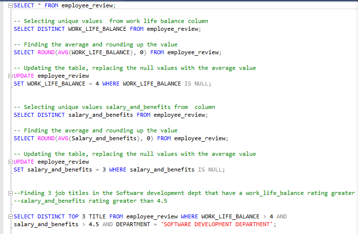
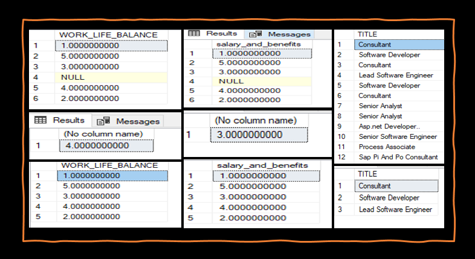
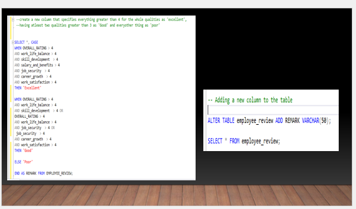
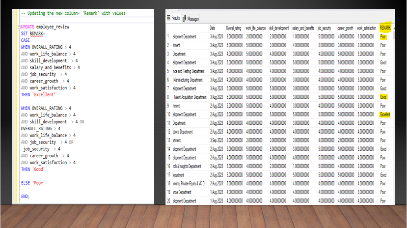

# Deriving Insights from Datasets using SQL

----
## Introduction
Structured Query Language (SQL) was employed in this task to generate database, import datasets and also generate insights from these datasets using various functions in SQL. Four sets of datasets presented in tables, were used in this analysis. They were imported into a database named 'PRACTICE' . They are; 
- Employee_review dataset (https://github.com/SeunA88/Deriving-Insights-from-Datasets-using-SQL/blob/main/employee_review.csv)
- Employee dataset (https://github.com/SeunA88/Deriving-Insights-from-Datasets-using-SQL/blob/main/Employee.csv)
- Department dataset (https://github.com/SeunA88/Deriving-Insights-from-Datasets-using-SQL/blob/main/Department.csv)
- Salary dataset (https://github.com/SeunA88/Deriving-Insights-from-Datasets-using-SQL/blob/main/Salary.csv)

From these data sets, the following tasks were analysed:
Using the Employee_review dataset; 
1. Find the job title in the "Software developement" department that have a work life balance rating greater than 4 and a salary and benefits rating greater than 4.5.
NB: Endeavour to check whether there are null values in work_life_balance column and the salary_and_benefit rating and do the needful (fill with average)

2. Using case statement, create a new column that specifies everything greater than 4 for the whole qualities as 'excellent', having atleast two qualities greater than 3 as 'Good' and everyother thing as 'poor'
for e.g if overall_rating, work_life_balance, salary_and_benefit, skill_developement, career_growth, job_security and work_satisfaction is greater than 4 classify as ‘excellent’.  Then if atleast 3 of these qualities is greater than 4 classify as ‘Good’ otherwise classify as ‘Poor’

3. Using the other three tables above,show the average yearly increment for employees in each department. Show departments with an average yearly increment greater than 5000 only.
---

## Analysis of Datasets
**Find the job title in the "Software developement" department that have a work life balance rating greater than 4 and a salary and benefits rating greater than 4.5.**
To generate this insight the following analysis were carried out:
1. Unique values were first selected from the work life balance and the salary and benefits rating columns to check for the presence of null values.
2. Average value for each column was calculated and used to replace all the null values in the columns.
3. The job distinct job titles that have a work life balance rating greater than 4 and a salary and benefits rating greater than 4.5 were then generated and further streamlined to Top 3.
   
#### Below are the queries used for this analysis

---
**Using case statement, create a new column that specifies everything greater than 4 for the whole qualities as 'excellent', having atleast two qualities greater than 3 as 'Good' and everyother thing as 'poor'.**
To generate this insight the following analysis were carried out:
1. A 'CASE' statement was generated firts to show all the conditions stated.
2. The table was then altered to add a new column called 'REMARK'.
3. The new column 'REMARK' was the updated to have values.

#### Below are the queries used for this analysis

---
  

